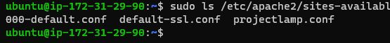
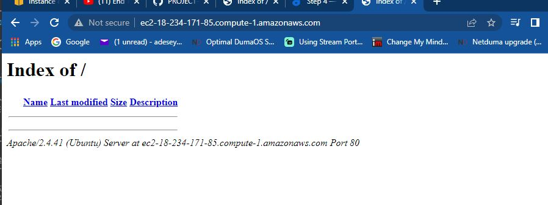
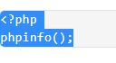

 ### DOCUMENTATION OF PROJECT - 1: LAMP STACK IMPLEMENTATION

 ## 
WEB STACK IMPLEMENTATION (LAMP STACK) IN AWS
 

1.Installed the following applications:

*Microsoft Visual Studio Code  [Download](https://code.visualstudio.com/download)

*git  [Download](https://git-scm.com/downloads)

*Windows Terminal [Download](https://apps.microsoft.com/store/detail/windows-terminal/9N0DX20HK701?hl=en-gb&gl=GB)

2.Created a Git Hub account, updated profile

3.Created a new repository 

4.Intergrated MS Visual Studio Code with Git Hub using following codes 

<code>git clone git@github.com:Adeseye/PROJECT-1.git</code>

Copied and pasted code into vsc terminal

5.Configured Git hub account with MS VSC via Terminal - using the following commands in VSC terminal :

<code>git add .</code>

<code> git commit -m "Writing project-1" </code>

<code>git push</code>

4.Signed up for AWS freetier account and a root user account, logged into AWS Management Console Services  

*Launched an instance -  Using Ubuntu Server 20.04LTS(HVM)

*Connected to instance via OpenSSH (SSH client)

*Connected to Ubuntu Server via Windows PowerShell using command

<code>ssh -i "Keypair.pem" ubuntu@ec2-54-147-140-31.compute-1.amazonaws.com</code>

* Practiced other Linux commands, ran the <code> sudo apt get-update</code> to update the OS.

## 
INSTALLING APACHE AND UPDATING THE FIREWALL

To install Apache web server, open up Terminal and run the following commands ;

*First update a list of packages in the package manager

<code> sudo apt update</code>

*Next Installing apache2 web server 

<code>sudo apt install apache2</code>

*To verify that the apache2 web server is running , run the command below

<code>sudo systemctl status apache2</code>

Web Server successfully launched! :sunglasses:

To enable Web Server to receive any traffic we need to open port HTTP port 80 by editing inbound rule by clicking on the instance... EC2 --> Security-->sg-0b43ccbb91eb6f08e (instance name) -Firewall security group> edit inbound rules; click Add rule button

Select Type "HTTP"  Protocol "TCP" Port range "80" and save rules.

To check I can access my server locally, I ran the following commands in the Terminal 

<code>curl http http://localhost:80</code>

or

<code>curl http://127.0.0.1:80</code>

This confirms I can access server locally, now time to test my Apache HTTP server can respond to request from the internet. By typing my public address found on AWS Web console or by running <code>curl -s http://169.254.169.254/latest/meta-data/public-ipv4</code> command.

Which is **54.147.140.31**

Now to verify the Apache server is correctly installed, open a browser type in the Public IP address into the address bar http://54.147.140.31:80

This confirms Apache Server running ; correctly installed and can be accessed through my firewall. :thumbsup:

## 
INSTALLING MYSQL

Now that Apache web server is up and running, now am going to install MySQL server which is a Database Management System (DBMS). This will store and manage data on my website.

On Terminal run the command to install MySQL

<code>sudo apt install MySQL-server</code> and type Yes

Type Y for yes and hit the enter key install MySQL.

It is recommended you run a security script that comes preinstalled with MySQL, This script will remove some insecure default settings and lock down access to your database system. 

Start the interactive script by running:

<code>sudo mysql_secure_installation</code>

You would be prompted to VALIDATE PASSWORD PLUGIN. - Press Y to create a password. You would be shown password type and strength level, enter a strength level and a password.

Next you would be prompted to remove some anonymous users and the test database, disable remote root logins, and load these new rules so that MySQL immediately respects the changes you have made.

To test I can access or login to the MYSQL console, run the command <code>sudo mysql</code>

This confirms am able to access MySQL console, to exit the MySQL console. 
Run exit command   <code>ext</code>

That concludes installing and configuring MySQL.

## 
INSTALLING PHP
 

I currently have Apache installed to serve my content, MySQL installed to store and manage my data. PHP is the component of my setup that will process code to display dynamic content to the end user, a PHP module that allows PHP to communicate with MySQL-based databases.

I will need to install 3 PHP packages ; to-do that I will the command 

<code>sudo apt install php libapache2-mod-php php-mysql</code>

Once installation has completed, to check the PHP version run the command <code>PHP -v</code>

At the time of this documentation ***PHP version is 7.4.3***

Next is to test my setup with a PHP script by setting up Apache Virtual Host to host my website' files and folders. 

A virtual host allows you to have multiple websites located on a single machine and users of the website wouldn't notice it.

## 
CREATING A VIRTUAL HOST FOR A WEBSITE USING APACHE

I'm going to setup a domain called ***projectlamp*** , to create the directory projectlamp
using 'mkdir' command as follows

<code>sudo mkdir /var/www/projectlamp </code>

Next assign ownership of the directory with current system user:

<code> sudo chown -R $USER:$USER /var/www/projectlamp</code>

Then to create and open a new configuration file in Apache's directory using the command line

<code>sudo vi /etc/apache2/sites-available/projectlamp.conf</code>

This will create a new blank file, now paste the following bare bones configuration by hitting i on the keyboard to enter the insert mode and paste the text below

To save and close the file, simply follow the steps below:

Hit the esc button on the keyboard

Type :

Type wq. w (for 'write'and 'q'' for quit)

Hit Enter key to save the file

To confirm it created directory successfully run the command; 

<code>sudo ls /etc/apache2/sites-available</code>

A file called 000-default.conf  default-ssl.conf  projectlamp.conf would be listed

The file ***000-default.conf  default-ssl.conf  projectlamp.conf*** is the virtual host configuration,  this will enable Apache to serve projectlamp using /var/www/projectlampl as its web root directory. 

Now to enable the virtual host using a2enite command ;

<code>sudo a2dissite 000-default</code>

To make sure your configuration file doesn’t contain syntax errors, run

<code>sudo apache2ctl configtest</code>

Finally, reload Apache so these changes take effect:

<code>sudo systemctl reload apache2</code>

Now the website is now active , but the web root ***/var/www/projectlamp*** is still empty. I'm going to create an index.html in the location so confirm that the virtual host works.

<code>sudo echo 'Hello LAMP from hostname' $(curl -s http://169.254.169.254/latest/meta-data/public-hostname) 'with public IP' $(curl -s http://169.254.169.254/latest/meta-data/public-ipv4) > /var/www/projectlamp/index.html </code>

Now open a browser and open website URL using IP address: using public address or public DNS. To view the landing page (Index.html)

## 
ENABLE PHP FOR WEBSITE

Create a new file named index.php inside your custom web root folder: using VIM.

<code> vim /var/www/projectlamp/index.php </code>

This will open a blank file. Add the following text, which is valid PHP code, inside the file:

Write and exit with vim with the command <code>wq</code> , now reload the website which is (http://54.167.65.122:80)

This is the result of the changes:-

This page provides information about your server from the perspective of PHP. It is useful for debugging and to ensure that your settings are being applied correctly.

This page confirms PHP installation is working as expected.

Its best practice to remove such sensitive information about your PHP environment -and your Ubuntu server. I will remove this page using  'rm' to do so:

<code>sudo rm /var/www/projectlamp/index.php</code>

This is the end of this project, I have fully successfully deployed LAMP stack website in AWS Cloud.

END