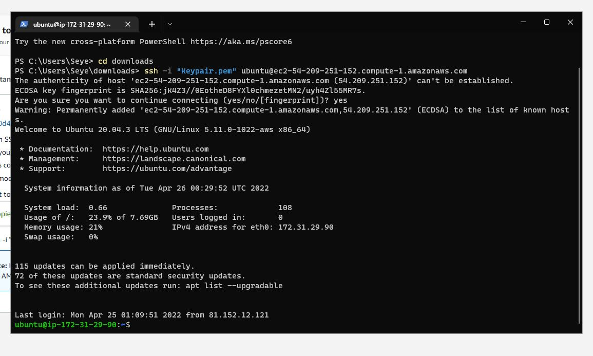

 ### DOCUMENTATION OF PROJECT - 1
 ## 
WEB STACK IMPLEMENTATION (LAMP STACK) IN AWS
 

1.Installed the following applications:

*Microsoft Visual Studio Code  [Download](https://code.visualstudio.com/download)

*git  [Download](https://git-scm.com/downloads)

*Windows Terminal [Download](https://apps.microsoft.com/store/detail/windows-terminal/9N0DX20HK701?hl=en-gb&gl=GB)

2.Created a Git Hub account, updated profile

3.Created a new repository 

4.Intergrated MS Visual Studio Code with Git Hub using following codes 

<code>git clone git@github.com:Adeseye/PROJECT-1.git</code>

Copied and pasted code into vsc terminal

5.Configured Git hub account with MS VSC via Terminal - using the following commands in VSC terminal :

<code>git add .</code>

<code> git commit -m "Writting project-1" </code>

<code>git push</code>

4.Signed up for AWS freetier account and a root user account, logged into AWS Management Console Services  

*Launched an instance -  Using Ubuntu Server 20.04LTS(HVM)

*Connected to instance via OpenSSH (SSH client)

*Connected to Ubuntu Server via Windows Powershell using command

<code>ssh -i "Keypair.pem" ubuntu@ec2-54-147-140-31.compute-1.amazonaws.com</code>

* Praticed other linux commands, ran the <code> sudo apt get-update</code> to update the OS.

## 
INSTALLING APACHE AND UPDATING THE FIREWALL
